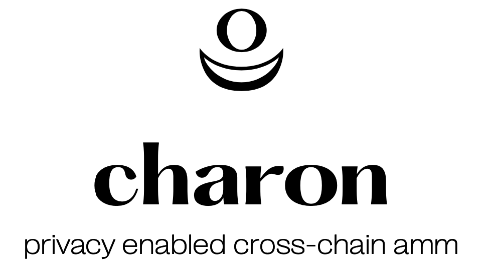

<p align="center">
    
</p>


<b>Charon</b> is a privacy enabled cross-chain automated market maker (PECCAMM). It achieves privacy by breaking the link between deposits on one chain and withdrawals on another.  Charon works by having AMMs on multiple chains, with one of the assets on each AMM being the charon dollar(CHD), a free-floating price-neutral token created by deposits on an alternate chain and then a withdrawal via a zero-knowledge proof . To achieve this cross-chain functionality, charon utilizes an oracle to pass commitments (proof of deposits) between chains.  

For more information, check out the [whitepaper](https://github.com/themandalore/charon/blob/main/public/whitepaper.pdf)

## Setting up and testing

First, you must have the Circom 2 compiler installed. See [installation
instructions](https://docs.circom.io/getting-started/installation/) for details.

The build step compiles the circuit, does untrusted setup, generates verifier contract, and compiles all the contracts. It could take a while at the setup step.

```sh
npm install
npm run build
npm run test
```

## Benchmark

```sh
npm run info
```

## Donations

ETH - 0x92683a09B64148369b09f96350B6323D37Af6AE3